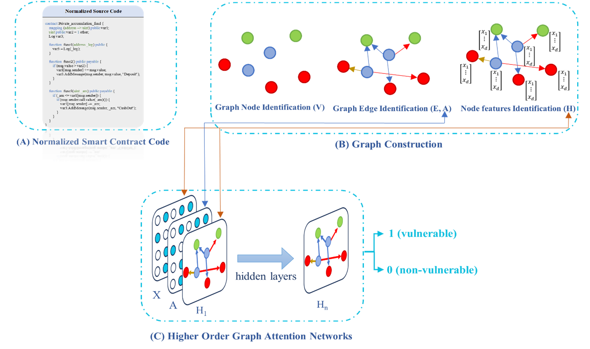

# HOGAT: Higher-Order Graph Attention Networks for Vulnerability Detection in Smart Contracts

This repository provides the implementation of **HOGAT**, a novel framework for detecting vulnerabilities in smart contracts using higher-order graph attention networks. The method focuses on capturing long-range dependencies in contract execution flows through multi-hop attention mechanisms. It is evaluated on real-world datasets for vulnerabilities like reentrancy, timestamp dependency, integer overflow/underflow, and infinite loops.

The code includes scripts for code normalization, graph construction, model training/evaluation, and sample Solidity contracts for testing (e.g., vulnerable and non-vulnerable examples in the `contracts/` directory).

For details, see the associated paper: *HOGAT: Higher-Order Graph Attention Networks for Vulnerability Detection in Smart Contracts* (2025).

## Table of Contents
- [Overview](#overview)
- [Architecture](#architecture)
- [Installation](#installation)
- [Usage](#usage)
- [Datasets](#datasets)
- [Results](#results)
- [Citation](#citation)
- [License](#license)
- [Acknowledgments](#acknowledgments)

## Overview
HOGAT addresses limitations in traditional and graph-based vulnerability detection by employing stacked GAT layers for k-hop aggregation in a unified contract graph. Key features:
- Code normalization to standardize Solidity source.
- Heterogeneous graph construction with vulnerability indicators, functions, and variables.
- Multi-hop attention for refined node embeddings and binary classification (vulnerable/non-vulnerable).

This repo allows reproduction of experiments and testing on custom contracts.

## Architecture
The HOGAT workflow is divided into three phases, as shown in Figure 1:

**Explanation of the Figure:**
- **(A) Normalized Smart Contract Code**: Input Solidity code after normalization (e.g., removing comments, standardizing variables/functions like `var1`, `func1`). This step reduces noise and ensures consistency.
- **(B) Graph Construction**: Transforms code into a Contract Graph \( G = (V, E, A) \):
  - **Graph Node Identification (V)**: Nodes categorized as vulnerability indicators (red circles), user-defined functions (blue circles), and variables (green circles).
  - **Graph Edge Identification (E, A)**: Edges represent control-flow (solid arrows), data-flow (dashed arrows), and fallback dependencies, with adjacency matrix A.
  - **Node Features Identification (H)**: Assigns features like type encodings, keyword matches, centrality, and edge proportions.
- **(C) Higher-Order Graph Attention Networks**: Processes the graph through multi-layer attention with hidden layers (H1 to Hn). Input features X are aggregated to produce embeddings, classified as 1 (vulnerable) or 0 (non-vulnerable) via sigmoid.

This design enables propagation of vulnerability signals across distant nodes, improving detection of non-local issues.

## Installation
### Requirements
- Python 3.8+
- PyTorch 2.0+
- PyTorch Geometric
- Additional: NumPy, Scikit-learn, Slither (for parsing Solidity)

This runs normalization, graph building, and prediction.

## Datasets
- **ESC**: Ethereum contracts for reentrancy/timestamp (~40k contracts).
- **VSC**: VNT Chain for infinite loops (~4k contracts).
- **SolidiFI**: Bug-injected benchmark for overflow/underflow.

Place downloaded datasets in `data/` (links in paper).

## Results
HOGAT achieves ~89.8% average F1-score, with 3-10% gains over baselines. See paper for tables.

